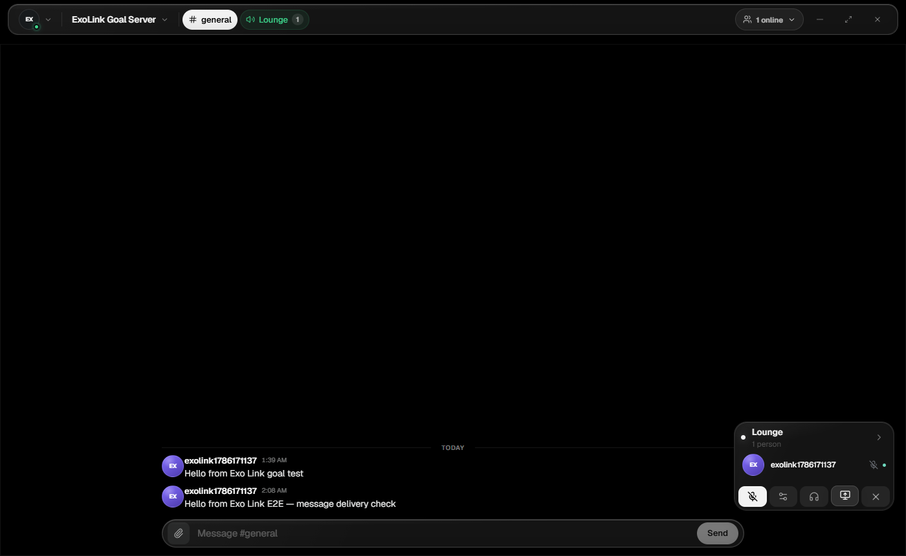
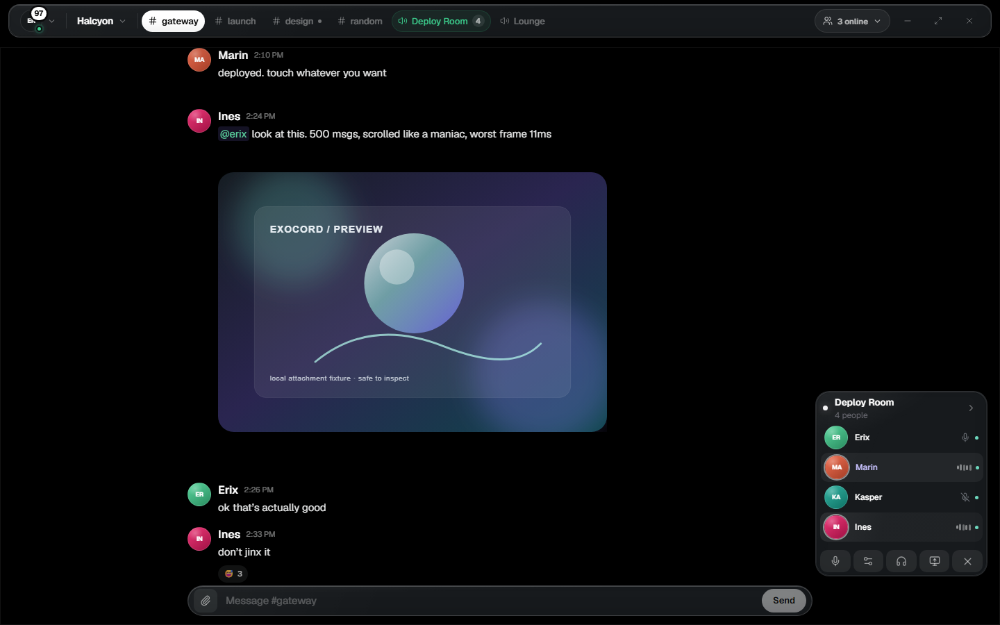

# Exocord

**Presence without weight.**

Exocord is **native desktop chat** for servers, DMs, and voice — built for people who want speed and privacy without a browser tab farm. AMOLED dark. Calm chrome.

  <a href="https://github.com/ImAvgErix/Exocord/releases/latest"><strong>Download Exocord</strong></a>

  

## What it does for you

| | |
| --- | --- |
| **Talk without the mess** | Servers, channels, DMs, friends — in a real Windows app |
| **Voice that feels native** | Rooms, devices, screen share, push-to-talk |
| **Private by design** | Encrypted paths and local cache on your machine |
| **Yours to host** | Point at a server you run — or join one you trust |

  

## How you use it

1. Download **Exocord.exe** from [Releases](https://github.com/ImAvgErix/Exocord/releases/latest)  
2. Run the Windows installer → open from Start  
3. Sign in or connect to your server  

Windows 10/11 x64. Alpha builds may ask for an API URL once.

## Privacy

See [PRIVACY.md](PRIVACY.md).

## License

MIT © 2026 Erix ([ImAvgErix](https://github.com/ImAvgErix))

Presence without weight.

